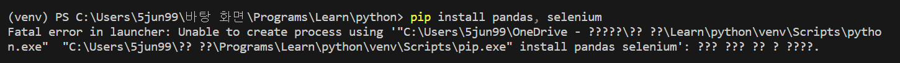

# 프로젝트의 동기

평소에 주식 공부를 해두면 좋겠다라는 생각이 있었는데, python 도 좀 익혔겠다 싶어서 라이브러리를 이용한 작은 프로젝트를 진행하자 싶어서 시작했다.

# 출처, 참고

아무리 작은 거지만 처음으로 하는 프로젝트인지라 다른 분의 코드를 그대로 따라 해보자라고 생각했고 즉 앞으로의 모든 것은 나도코딩 유튜브 님의 [주식정보 크롤링하기](https://youtu.be/ZDh1C7qw0Rs) 유튜브 영상을 참고한 것이다. 

# 시작

## 크롤링

주식 정보를 크롤링하기 전에는 크롤링이 무엇인지부터 알아봐야했다. 그동안 학부에서 통계청이나 다른 통계 사이트에서 올려놓은 csv 파일을 가지고 표를 다루거나 시각화는 기본적으로 해봤지만 직접 크롤링하는 것은 처음이었다. 

### 크롤링이란?

> 크롤링은 웹 페이지에서 정보를 수집하는 프로세스를 말합니다. 웹 크롤링은 인터넷 상의 다양한 웹 페이지를 방문하고 그 안에 있는 데이터를 수집하는 자동화된 작업을 의미합니다. 이를 통해 웹 사이트에서 데이터를 추출하거나 필요한 정보를 수집할 수 있습니다.  
>  \- chat gpt

### 크롤링 과정

  * 웹페이지 확인

  * HTML 파싱 - 코드를 잘라서 라이브러리를 사용하여 추출한다는 뜻 같다

  * 데이터 추출 - 파싱된 데이터에서 유용한 정보 추출

  * 데이터 저장

### 주의 사항

웹 크롤링은 제한되는 경우가 있고 해당 서버에 부하를 줄 수 있기 때문에 딜레이를 설정하거나 api를 사용하는 게 좋다고 한다. 

## 주식

이 뒤는 하면서 배우게 되는 지식이나 단어들을 적어놓을 생각이다. 코딩이 목적이기도 하지만 주식체계를 배우는 것도 목적이지만. ~~근데 왠지 추가 지식은 나중에 따로 알아봐야할 거 같은 느낌~~

# 패키지 설치

## pandas

학부에서 파이썬 배울 때도 썼던 패키지이다. 주로 dataframe을 브라우저에서 긁어오거나, 긁어온 df를 정제할 수 있는 함수들도 가지고 있다.

> series : 1차원 배열 형식 index 와 value 값만이 존재  
>  dataframe = 2차원 배열 형식 index colums에 맞는 value 존재

더 많은 정보는 추후에 pandas 패키지만 따로 정리하는 글을 올려보겠다

## seleniums

설치된 크롬 드라이버를 이용해서 크롬을 제어하기 위해서 사용하는 데에 쓰인다.  
웹 크롤링을 할 때 주로 쓰이는 패키지이다. 브라우저를 열 수 있는 것은 물론 url을 조작하여 원하는 웹사이트에 접근할 수 있고, 그 안에서 함수를 이용해 브라우저 조작도 가능하다(클릭, 입력)

대표적으로 

> browser = webdriver.Chrome(드라이버의 경로 or 공백 (같은 경로에애 있을 때))  
>  browser.get(url // 링크)

## lxml

먼저 xml에 대한 정보를 알아둬야 좋을 것 같다. 

> xml이란?  
>  트리구조를 가지고 있는 파일을 표현하기 용이하게 하기 위해 만들어진 마크업 언어

이번에 사용하는 html도 xml의 대표적인 예시이다. 워드 프로세서나 스프레드시트 ppt 이런 것들 모두 xml의 일종이다.  
근데 이런 xml을 해석(파싱)해주는 도구(패키지)가 바로 lxml인 것이다.  
크롤링 과정을 알아봤을 때 그 중 html 파싱이라는 단계가 있었는데 거기에 사용되는 것으로 보인다.  
이번 연습에서는 pandas dataframe을 만들 때 page_source를 불러올 때 사용되는 것으로 보인다.

### 오류

처음에 pip install 을 이용하여 패키지, 모듈을 설치하려고 했는데 반복적으로 오류가 났다.

구글링을 해보니 pip 버전이 맞지 않아서 그럴 수 있다고, 업그레이드를 해보라고 했다. 해보니 오류가 해결 되었다.

# 코드 작성

## 0\. import 및 웹브라우저 열기, 웹드라이버 설치

### 웹드라이버 설치

코드에서 웹브라우저를 열려면 사용하는 브라우저의 웹드라이버를 설치해야한다. 여기서는 크롬을 사용할 것이니 크롬웹드라이버를 설치한다.  
<https://chromedriver.chromium.org/downloads> 링크에 들어가 컴퓨터에 깔려있는 크롬의 버전에 맞는 드라이버를 설치한다.  
여기서 크롬 버전은 어떻게 확인하느냐라는 질문을 할 수 있는 데 이는 크롬 url 창에 chrome://version/ 을 치면 나오는 버전 번호를 확인하면 해결할 수 있다.

### import

드라이버를 설치했으면 코드를 작성해 볼 차례이다.
    
    
    import os
    import pandas as pd
    from selenium import webdriver
    from selenium.webdriver.common.by import By
    
    browser = webdriver.Chrome()
    browser.maximize_window() # 창 최대화
    

설치했었던 라이브러리들을 Import 해준다.  
browser 이라는 객체를 만들어 웹드라이버 Chrome 매서드의 반환값으로 설정한다. 이제 브라우저라는 객체에 어떠한 메서드를 작용하면 웹드라이버 기능을 구현할 수 잇는 것이다.  
여기서 Chrome 메소드에 드라이버 파일 위치정보를 나타내는 파라미터가 있어야하는데 내 개발 환경에서는 파일이 같은 폴더 안에 있어서 생략했다.

## 1\. 페이지 이동
    
    
    url = 'https://finance.naver.com/sise/sise_market_sum.naver?&page='
    browser.get(url) #브라우저 객체에 해당 경로 get

ulr 문자열 변수에 네이버 주식현황 웹사이트 주소를 넣어준다. 마지막에 page= 뒤에 공백인데. 이는 나중에 페이지를 넘어가며 다른 url을 만들기 위함이다.  
get(url)로 url정보를 객체에 넘겨준다

> **get( )**
> 
> * * *
> 
> 입력한 url 주소로 브라우저를 이동시키는 매소드

## 2\. 조회 항목 초기화

> **find_elements()**
> 
> * * *
> 
> HTML 안에 있는 요소를 찾아주는 매소드이다. elements이기 때문에 복수의 요소를 찾을 때 쓰인다. 
    
    
    checkboxes = browser.find_elements(By.NAME, 'fieldIds')
    for checkbox in checkboxes:
        if checkbox.is_selected(): # 지금 체크되어 있다면?
            checkbox.click() # 클릭 == > 체크해제

By의 속성 중 하나인 NAME을 이용한다. 체크박스의 html에서의 이름은 fieldIds이다. is_selected와 click 또한 celenium의 매소드이다.

## 3\. 조회 항목 설정(원하는 항목)
    
    
    items_to_select = ['영업이익', '자산총계', '매출액'] 
    # (억) 은 label이 아닌 그냥 text 엘리먼트이므로 이름은 그냥 label로 한다.
    
    for checkbox in checkboxes:
        parent = checkbox.find_element(By.XPATH, '..') # 부모 엘리먼트 찾기
        label = parent.find_element(By.TAG_NAME, 'label')
        if label.text in items_to_select:
            checkbox.click() # 다시 체크  

원하는 체크박스를 선택하기 위하여 체크박스들의 부모 개체를 선언하고 개체 안에 tagname이 label인 것들의 text가 원하는 태그인지를 확인 후 체크한다.

## 4\. 적용하기 버튼 클릭
    
    
    btn_apply = browser.find_element(By.XPATH, '//a[@href="javascript:fieldSubmit()"]')
    # // == > html 전체 문서에서 찾겠다. a (태그) [@ href 속성을 가진 "~"]
    btn_apply.click()

## 5\. 데이터 추출
    
    
    df = pd.read_html(browser.page_source)[1] 
    # 코스피 테이블 / page_source 는 뭉탱이(테이블) 찾는 듯
        df.dropna(axis='index', how='all', inplace=True)
        # 행 단위로 지우는데 모두 값이 nan일 때 지운다. inplace == > dataframe에 적용할 것인가
        df.dropna(axis='columns', how='all', inplace=True)
        # 테이블에서 span은 13으로 설정되어 있는데 (우리가 지운 행들에서는 13으로 남아있었음) 때문에 col 10 11 12 가 모두 nan으로 남아 있는것

이제 판다스를 이용하여 html에 있는 browser 객체의 페이지 소스들을 데이터 프래임으로 만들어준다. html에 있던 테이블은 세가지 정도 있었다. check박스들, 주식 정보들, 페이지 숫자 그 중 우리는 두번째 값이 필요하니 인덱싱 해준다.  
dropna는 nan 값들을 없애주는 메소드 이다. axis는 행과 열 중 선택할 수 있다.

## 6\. 파일 저장 및 반복문 설정
    
    
    f_name = 'sise.csv'
        if os.path.exists(f_name):
            # 파일이 있다면 헤더부분은 제외
            df.to_csv(f_name, encoding='utf-8-sig', index=False, mode='a', header=False)
            # 한글로 저장하기 때문에 인코딩 요함
            # mode = a 는 붙여 쓰는 것
        else:
            df.to_csv(f_name, encoding='utf-8-sig', index=False)browser.quit()
    
    
    for idx in range(1, 10): # 1~ 10 페이지
        browser.get(url + str(idx))

반복문에서는 브라우저에 들어갈 url을 바꿔가며 데이터프레임을 수집한다.

# 마치며

금방 끝나는 코딩이기도 하고 유튜브에 있는 강의를 그대로 따라한 거긴하지만 한동안 알고리즘만 하던 파이썬으로 판다나 셀레니움으로 웹크롤링을 해보니 꽤 재밌었다. html 배웠던 거도 생각이 나고 했다. 알고리즘을 공부하며 배운 게 별로 없는 거 같아 기분이 안 좋았는데 코드를 읽는 흐름이라든지 조금씩 능력이 향상된 부분이 있는 거 같아서 기분좋았던 경험이었다.
