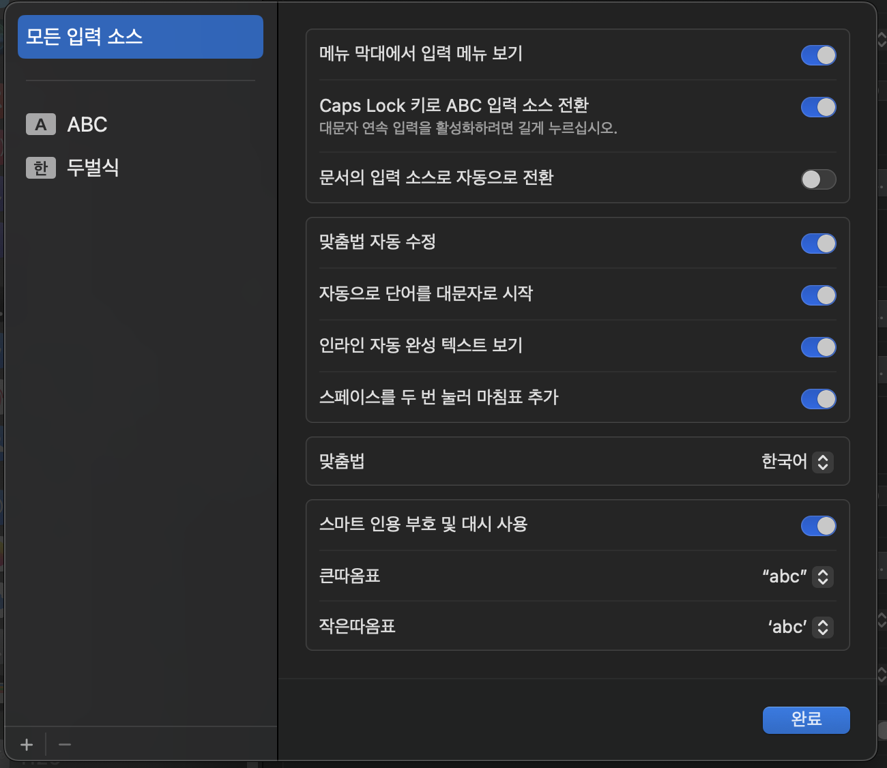

이번 맥북 os와 ios 업데이터에서 맥북과 아이폰의 미러링 기능이 생겼다는 소식에 좀처럼 움찔하지 않는 내 호기심이 움직였다.

하지만 생각보다 많은 오류들이 있었는데, 그 중 하나가 한글 입력소스가 업데이트마다 없어진다는 것이다. 빡대가리인 나는 베타 버전 추가 업데이트가 있을 때마다 없어지는 한글에 당황하여 구글링을 반복했고, 벨로그에 적어놓으면 조금이라도 기억하지 않을까 하는 마음에 기록한다.

방법은 간단하다.   
키보드 설정에 들어가주시고  
  
요 부분에서 편집 버튼을 눌러주시고  
  
여기서 이제 입력소스를 추가하면 되는데  
이 썩을 놈들 추가할 수 있는 부분을 너무 숨겨놨어.. 맥북 쓰는 사람은 다 영어쓰냐?  
맨 왼쪽 아래에 +|- 부분에서 한국어를 찾아서 추가하면 된다.  
해결 완료!!
